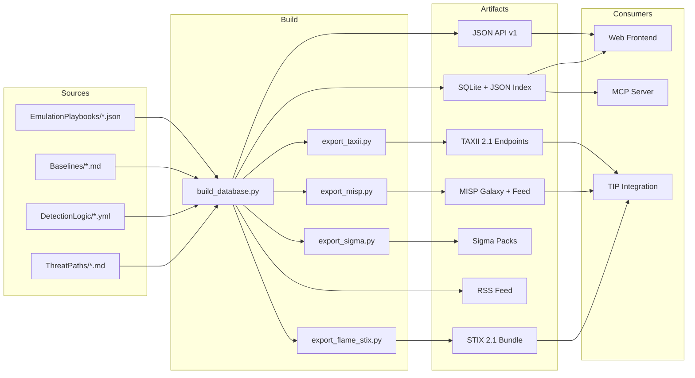
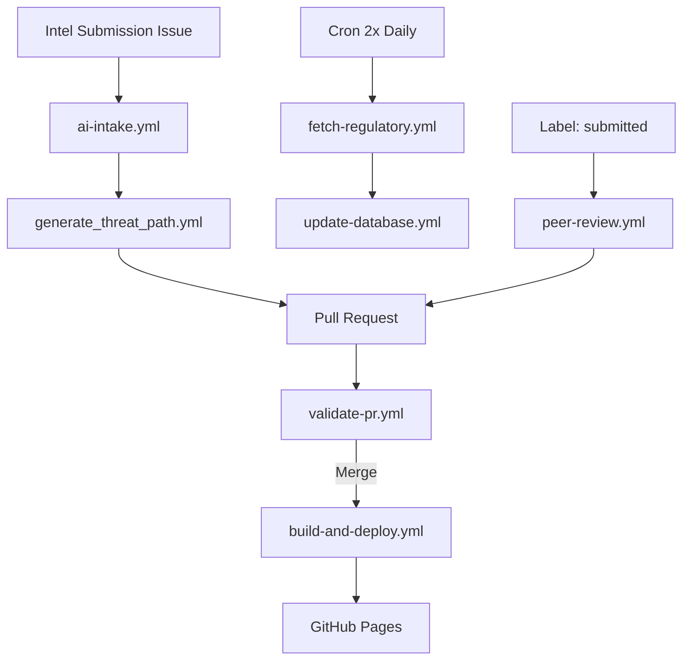

[](https://github.com/elchacal801/flame-fraud/actions/workflows/build-and-deploy.yml)
[](LICENSE)
[](https://www.python.org/)
[](ThreatPaths/)
[](DetectionLogic/)
[](docs/STIX-FRAUD-EXTENSION.md)
[](mcp_server/)

# FLAME -- Fraud Lifecycle Analysis & Mitigation Exchange

**Everyone built the dictionary. Nobody built the library.**

FLAME is an open-source, community-driven platform for sharing structured fraud detection intelligence across organizational and framework boundaries. Every submission maps simultaneously to **6 fraud frameworks**, exports to **STIX 2.1 / MISP / TAXII / Sigma**, and is browsable through a zero-dependency web interface with D3-powered visualizations, AI-assisted intake, and an MCP server for conversational fraud intelligence.

> **[Explore FLAME Live &rarr;](https://elchacal801.github.io/flame-fraud/)**

---

## At a Glance

| Metric | Count |
|--------|-------|
| **Threat Paths** | 50 (TP-0001 -- TP-0050) |
| **Detection Logic Rules** | 114 (Sigma-based; exported to SPL, EQL, KQL) |
| **Baselines** | 25 environmental profiling benchmarks |
| **Emulation Playbooks** | 7 adversary simulation scripts |
| **Fraud Types** | 71 in master taxonomy |
| **Sectors Covered** | 19 |
| **Framework Cross-Mappings** | 6 (CFPF, ATT&CK, Group-IB FM, Stripe FT3, UCFF, MITRE F3) |
| **Regulatory Requirements** | 15 across 6 jurisdictions |
| **Export Formats** | 7 (STIX, MISP, TAXII, Sigma/SPL, Sigma/EQL, Sigma/KQL, RSS) |
| **MCP Server Tools** | 7 |
| **CI/CD Workflows** | 7 |
| **Test Modules** | 13 (pytest) |

---

## Why FLAME Exists

Between April 2025 and February 2026, five organizations independently concluded that fraud needs structured taxonomy frameworks. Stripe published FT3 (then abandoned it). MITRE announced F3 (still hasn't shipped). Group-IB released Fraud Matrix 2.0 (commercially gated). FS-ISAC assembled 300+ members for the Cyber Fraud Prevention Framework. The taxonomy layer is converging. The **community knowledge exchange layer** remains entirely unserved in open source.

| Capability | FLAME | Group-IB FM 2.0 | FS-ISAC CFPF | Stripe FT3 | MITRE F3 |
|---|:---:|:---:|:---:|:---:|:---:|
| Open source | Yes | No | Paper only | Abandoned | TBD |
| Community contributed | Yes | No | No platform | No | TBD |
| Structured detection logic | 114 rules | Mobile-heavy | No | No | TBD |
| Multi-taxonomy mapping | 6 frameworks | Own only | Own only | Own only | TBD |
| TIP interop (STIX/MISP/TAXII) | Yes | No | No | No | TBD |
| AI-assisted intake | Yes | No | No | No | No |

**Taxonomies define the language. FLAME is where practitioners share what actually works.**

---

## Supported Frameworks

| Framework | Status |
|-----------|--------|
| FS-ISAC Cyber Fraud Prevention Framework (CFPF) | Primary structure -- all 50 TPs mapped |
| MITRE ATT&CK | Supplementary mapping where applicable |
| Group-IB Fraud Matrix 2.0 | Cross-reference mapping (stage names) |
| Stripe FT3 | Mapped (44/50 TPs) via `ft3_mapper.py` |
| Group-IB UCFF | Defense-side maturity alignment (7 domains) |
| MITRE F3 | Placeholder (will map when shipped) |

**What FLAME is not:** FLAME is not a taxonomy project. It is a knowledge exchange that sits on top of existing taxonomies, providing the operational intelligence -- threat paths, detection queries, investigation playbooks, and cross-team correlation guidance -- that no taxonomy alone delivers.

---

## Architecture

FLAME follows a **markdown-first, database-derived** architecture modeled on [HEARTH](https://github.com/THOR-Collective/HEARTH) by the THOR Collective.

- **Markdown is the source of truth.** Threat paths, baselines, and detection rules are authored as structured files with YAML frontmatter.
- **The database is derived.** Python scripts parse the source files, build a SQLite index, and export JSON for the frontend.
- **The frontend is static.** Vanilla HTML/CSS/JS served via GitHub Pages. No build step, no framework dependencies.
- **Exports are standard.** Build-time pipelines produce STIX 2.1, MISP, TAXII 2.1, Sigma, and RSS artifacts.
- **CI/CD is automated.** GitHub Actions validate submissions, rebuild the database, and regenerate all exports on merge.

### Data Flow



### CI/CD Pipeline



---

## Repository Structure

```
ThreatPaths/           50 fraud scheme lifecycle mappings (TP-XXXX.md)
DetectionLogic/        114 Sigma-based detection rules (DL-XXXX.yml)
Baselines/             25 environmental profiling benchmarks (BL-XXXX.md)
EmulationPlaybooks/    7 adversary simulation playbooks (EP-XXXX.json)
Templates/             Submission templates (TP, DL, BL, EP)
config/                Regulatory requirements and source configs
scripts/               Build, validation, and export scripts (22 modules)
  regulatory/          6-source regulatory data fetchers
mcp_server/            FastMCP server exposing 7 fraud intelligence tools
tests/                 13 pytest test modules
database/              Generated artifacts (auto-built by CI)
  flame-index.json           Metadata-only index (fast frontend load)
  flame-content/             Individual TP content files (lazy-loaded)
  flame-stats.json           Pre-computed aggregate statistics
  flame-contributors.json    Contributor leaderboard data
  flame_stix_bundle.json     STIX 2.1 bundle with fraud extensions
  flame_detection_rules.json Aggregated detection rules
  sigma-exports/             Sigma packs (SPL, EQL, KQL)
  misp-feed/                 Per-TP MISP event files + manifest
  regulatory-alerts.json     Automated regulatory alert feed (6 sources)
  feed.xml                   RSS 2.0 feed
data/                  Taxonomies, framework mappings, MISP galaxy defs
api/
  v1/                  Static JSON API endpoints
  taxii/               TAXII 2.1 discovery, collections, objects
docs/                  Project documentation and specifications
.github/
  workflows/           7 CI/CD workflows
  ISSUE_TEMPLATE/      5 issue templates for submissions
```

---

## Threat Path Collection

FLAME ships with **50 threat paths** covering **71 fraud types** across **19 sectors**.

| ID | Scheme | Key Fraud Types |
|----|--------|-----------------|
| TP-0001 | Treasury Management ATO via Malvertising | ATO, vishing, wire fraud |
| TP-0002 | BEC -- Vendor Impersonation Wire Fraud | BEC, invoice fraud |
| TP-0003 | Synthetic Identity -- Credit Card Bust-Out | Synthetic identity, application fraud |
| TP-0004 | Payroll Diversion via HR Portal Compromise | Payroll diversion, BEC |
| TP-0005 | Insurance Premium Diversion via Agent Portal ATO | ATO, premium diversion |
| TP-0006 | Real Estate Wire Fraud -- Closing Scam | BEC, wire fraud |
| TP-0007 | Deepfake Voice Authorization for Wire Transfer | Deepfake, impersonation |
| TP-0008 | SIM Swap to Cryptocurrency Exchange ATO | ATO, crypto laundering |
| TP-0009 | Check Washing and Fraudulent Mobile Deposit | Check fraud |
| TP-0010 | Disability Insurance Fraud | Fraudulent claims |

### Recently Added

| ID | Scheme | Key Fraud Types |
|----|--------|-----------------|
| TP-0041 | RDGA-Based Infrastructure Campaigns | RDGA infrastructure |
| TP-0042 | TDS Chain Exploitation | TDS exploitation, malvertising, phishing |
| TP-0043 | AI-Accelerated Fraud Infrastructure Generation | AI infrastructure, phishing, brand impersonation |
| TP-0044 | State-Criminal Infrastructure Convergence | State-criminal convergence, crypto laundering |
| TP-0045 | Sanctions Evasion via Fraud Infrastructure | Sanctions evasion, crypto laundering |
| TP-0046 | Geopolitically-Timed Fraud Campaigns | State-criminal convergence |
| TP-0047 | Human Trafficking-Linked Fraud Infrastructure | Human trafficking facilitation, scam compounds |
| TP-0048 | Bulletproof Hosting Migration Patterns | BPH migration, sanctions evasion |
| TP-0049 | Cryptocurrency Laundering Infrastructure | Crypto laundering infrastructure, CMLN operations |
| TP-0050 | Calendar/Invite Injection Phishing | Calendar phishing, social engineering |

<details>
<summary><strong>View TP-0011 through TP-0040</strong></summary>

| ID | Scheme | Key Fraud Types |
|----|--------|-----------------|
| TP-0011 | Romance Scam to Money Mule Recruitment | Romance scam, money mule |
| TP-0012 | APP Fraud -- Tech Support / Bank Impersonation | Vishing, impersonation |
| TP-0013 | Credential Stuffing to Loyalty Point Drain | Credential stuffing, ATO |
| TP-0014 | Insider-Enabled Account Fraud | Insider threat, collusion |
| TP-0015 | Employment Fraud via Brand Impersonation | Job scam, identity theft |
| TP-0016 | First-Party Fraud (Bust-Out) | Bust-out, first-party fraud |
| TP-0017 | Pig Butchering (Investment Scam) | Investment scam, romance scam |
| TP-0018 | Deepfake Document Fraud | Deepfake fraud, documentary fraud |
| TP-0019 | Business Identity Theft | Identity theft, application fraud |
| TP-0020 | Supply Chain Payment Fraud | BEC, vendor impersonation |
| TP-0021 | Healthcare Provider Billing Fraud | Healthcare fraud, phantom billing |
| TP-0022 | Government Program Fraud | Benefit fraud, tax fraud |
| TP-0023 | Mobile Banking Trojan / Overlay Attack | Malware, ATO |
| TP-0024 | A2A Instant Payment Fraud (Zelle/FedNow/Pix) | APP, unauthorized transaction |
| TP-0025 | GenAI-Enhanced APP Fraud -- Romance Variant | Romance scam, deepfake |
| TP-0026 | GenAI-Enhanced APP Fraud -- Investment Variant | Investment scam, deepfake |
| TP-0027 | Elder Financial Exploitation | Social engineering, APP |
| TP-0028 | DME Phantom Billing (Medicare Fraud) | Healthcare fraud, phantom billing |
| TP-0029 | AI Synthetic Identity & Document Forgery | Synthetic identity, deepfake fraud |
| TP-0030 | E-Commerce Triangulation Fraud | Payment diversion, identity theft |
| TP-0031 | Refund-as-a-Service (FTID / RaaS) | Refunding-as-a-service |
| TP-0032 | Web3 Wallet Drainer / Approval Phishing | Approval phishing, crypto laundering |
| TP-0033 | Ghost Student Financial Aid Botnets | Ghost student fraud, application fraud |
| TP-0034 | DPRK State-Sponsored IT Worker Fraud | DPRK IT worker fraud, data theft |
| TP-0035 | Magecart E-Skimmer Data Compromise | E-skimmer, data theft |
| TP-0036 | Purchase Scam Merchant Networks | Purchase scam, brand impersonation |
| TP-0037 | Digital Wallet Fraud & NFC Relay Attacks | Digital wallet fraud, NFC relay |
| TP-0038 | Card Testing Infrastructure Abuse | Card testing, identity theft |
| TP-0039 | Agentic Commerce Fraud | Autonomous AI fraud, unauthorized transaction |
| TP-0040 | BNPL Multi-Provider Fraud | BNPL fraud, synthetic stacking |

</details>

See [ThreatPaths/INDEX.md](ThreatPaths/INDEX.md) for full cross-reference tables with sector, CFPF phase, and framework mappings.

---

## Detection Logic

FLAME ships **114 detection rules** as Sigma-compatible YAML, exported to three SIEM query languages:

- **Splunk SPL** -- `database/sigma-exports/splunk/`
- **Elasticsearch EQL** -- `database/sigma-exports/elastic/`
- **Microsoft Sentinel KQL** -- `database/sigma-exports/sentinel/`

76 rules are pure Sigma (boolean selection logic). 38 rules requiring aggregation or correlation include native query implementations with SIEM-specific guidance in `queries:` blocks (LogScale LQL, Splunk SPL, Elasticsearch).

Rules are organized by severity level (`informational`, `low`, `medium`, `high`, `critical`) and linked to specific threat paths via `threat_paths:` frontmatter. Each rule maps to a single CFPF phase.

---

## Emulation Playbooks

FLAME includes **7 adversary emulation playbooks** -- CFPF phase-mapped simulation scripts for testing detection coverage against specific fraud schemes.

| ID | Playbook | Linked TPs |
|----|----------|------------|
| EP-0001 | Synthetic Identity Bust-Out | TP-0003, TP-0016 |
| EP-0002 | BEC Wire Fraud | TP-0002, TP-0006 |
| EP-0003 | SIM Swap Crypto ATO | TP-0008 |
| EP-0004 | APP Fraud | TP-0012, TP-0024 |
| EP-0005 | A2A Payment Exploitation | TP-0024 |
| EP-0006 | RDGA Campaign Simulation | TP-0041 |
| EP-0007 | TDS Chain Exploitation Simulation | TP-0042 |

Playbooks follow a structured JSON schema with execution steps mapped to CFPF phases (P1--P5), cross-references to detection rules (DL-XXXX), and testability scoring. See `Templates/emulation-playbook-template.json` for the schema.

---

## Frontend & Visualizations

The FLAME frontend is a vanilla HTML/CSS/JS single-page application with a dark theme, responsive design, and no build step. It features D3.js-powered visualizations and interactive analysis tools.

### D3 Visualizations

| Visualization | Description |
|---|---|
| **Attack Flow Diagram** | Horizontal CFPF phase flow (P1--P5) per threat path with MITRE technique cards and detection rule badges |
| **Ego Neighborhood Graph** | Force-directed 1--2 hop subgraph showing related threat paths with typed relationships |
| **Global Relationship Graph** | Full-network force layout of all 50 TPs, sector-clustered with 7 color-coded relationship types |
| **UCFF Radar Chart** | 7-axis maturity profile for the UCFF self-assessment |
| **Coverage Heat Map** | Fraud type x CFPF phase coverage matrix with intensity-based coloring |
| **Framework Navigator** | Cross-framework coverage grid (CFPF, MITRE, Group-IB, FT3) with SVG and ATT&CK Navigator JSON export |

### Interactive Tools

| Tool | Description |
|---|---|
| **UCFF Self-Assessment** | Maturity sliders across 7 governance domains with gap analysis and JSON import/export |
| **Coverage Assessment** | Sector-specific fraud coverage analysis with phase weakness detection and gap scoring |
| **Regulatory Pulse** | Live feed from 6 regulatory sources (OFAC, FinCEN, SEC, OCC, FBI IC3, CFPB) with pagination and source filtering |
| **Contributor Leaderboard** | Ranked contributor table (TPs, DL rules, baselines, EPs) extracted from submission frontmatter |

### Additional Features

- **Full-text search** via lunr.js with wildcard fallback
- **Multi-criteria filtering** by CFPF phase, sector, and fraud type
- **Lazy content loading** -- metadata index loads first, TP content on demand
- **Taxonomy toggle** -- switch between CFPF, MITRE ATT&CK, and Group-IB views in detail
- **Hash-based routing** -- deep links via `#detail/TP-XXXX`
- **Copy-to-clipboard** on all code blocks
- **Mobile responsive** with collapsible filter panel

---

## Ecosystem Integration

### STIX 2.1 Fraud Extension

4 custom SDOs extending STIX 2.1 for fraud intelligence:

- `x-flame-fraud-scheme` -- Fraud lifecycle pattern (one per TP)
- `x-flame-financial-transaction` -- Fraudulent money movement pattern
- `x-flame-mule-network` -- Money mule infrastructure
- `x-flame-fraud-actor-profile` -- Threat actor profiling

5 fraud-specific relationship types. Deterministic STIX IDs (UUID5) ensure reproducible builds. See [STIX-FRAUD-EXTENSION.md](docs/STIX-FRAUD-EXTENSION.md) for the full specification.

### MISP Galaxy & Feed

A subscribable MISP galaxy with **50 cluster entries** cross-referenced to MITRE ATT&CK, plus a per-TP event feed at `database/misp-feed/`. Point your MISP instance feed URL to `database/misp-feed/manifest.json` on the GitHub Pages site.

### TAXII 2.1 Endpoints

Static TAXII 2.1-compatible files at `api/taxii/` with 3 collections:

1. Threat paths (as attack-pattern SDOs)
2. Detection rules (as course-of-action SDOs)
3. Baselines (for benchmarking)

Compatible with MISP, OpenCTI, ThreatConnect, and other TIPs. Configure your TIP with the TAXII root at `api/taxii/discovery.json`.

### Sigma Detection Packs

114 detection rules exported to **Splunk SPL**, **Elasticsearch EQL**, and **Microsoft Sentinel KQL** via pySigma. Rules using aggregation/correlation syntax include pseudocode fallback exports with SIEM-specific implementation guidance. Per-TP packs available in `database/sigma-exports/packs/`.

### RSS Feed

Auto-generated RSS 2.0 feed at `database/feed.xml` with threat paths and detection rules. Auto-discovery enabled in `index.html`.

### Static JSON API

RESTful JSON endpoints at `api/v1/`:

```
GET /threat-paths.json              All TPs with metadata
GET /threat-paths/TP-XXXX.json      Individual TP details
GET /detection-rules.json           All detection rules
GET /detection-rules/DL-XXXX.json   Individual rule
GET /baselines.json                 All baselines
GET /coverage-matrix.json           Coverage analysis matrix
GET /stats.json                     Aggregate statistics
GET /taxonomy.json                  Master taxonomy
```

### Regulatory Compliance

**15 regulations** across **6 jurisdictions** (EU, UK, US, Singapore, Australia, International) mapped to relevant threat paths via `regulatory_refs` frontmatter. Includes PSD3 SCA, UK PSR APP, FinCEN AML/BSA, FATF R16, MAS SRF, FFIEC Auth, DORA, and more.

**Automated regulatory intelligence** fetched 2x daily from 6 government sources:

| Source | Agency |
|--------|--------|
| OFAC | Treasury Dept -- Sanctions List |
| FinCEN | Financial Crimes Enforcement Network |
| SEC | Securities and Exchange Commission |
| OCC | Office of the Comptroller of the Currency |
| FBI IC3 | Internet Crime Complaint Center |
| CFPB | Consumer Financial Protection Bureau |

---

## MCP Server

FLAME includes a [Model Context Protocol](https://modelcontextprotocol.io) (MCP) server that exposes fraud intelligence through 7 tools, enabling AI assistants like Claude to query threat paths, detection rules, and framework mappings conversationally.

| Tool | Description |
|------|-------------|
| `search_threat_paths` | Search by keyword, sector, fraud type, CFPF phase, infrastructure method, geopolitical timing, or nation-state nexus |
| `get_threat_path` | Get full details of a specific threat path |
| `get_detection_rules` | Get detection rules filtered by TP, fraud type, or severity |
| `map_framework` | Get framework-specific mappings (cfpf, mitre, groupib, ft3, ucff) |
| `assess_coverage` | Assess fraud detection coverage by sector and fraud type |
| `get_baseline` | Get fraud baseline measurements for benchmarking |
| `look_left_right` | Analyze upstream/downstream threat relationships (CFPF Look Left/Right) |

**Example queries an AI assistant can answer via the MCP server:**

- "What fraud schemes target the insurance sector?"
- "Show me detection rules for wire fraud"
- "What MITRE ATT&CK techniques map to TP-0007?"
- "Assess my coverage for banking account-takeover and wire-fraud"
- "What threat paths feed into TP-0011?"
- "Which threat paths involve RDGA infrastructure?"
- "What is the UCFF maturity requirement for TP-0034?"

### Running the MCP server

```bash
python -m mcp_server.server
```

### Claude Desktop integration

Add the following to your Claude Desktop `claude_desktop_config.json`:

```json
{
  "mcpServers": {
    "flame-fraud": {
      "command": "python",
      "args": ["-m", "mcp_server.server"],
      "cwd": "/path/to/flame-fraud"
    }
  }
}
```

---

## CI/CD Pipeline

FLAME uses 7 GitHub Actions workflows for full automation:

| Workflow | Trigger | Purpose |
|----------|---------|---------|
| `build-and-deploy.yml` | Push to main | Run tests, validate TPs, rebuild database, export all artifacts, deploy to Pages |
| `validate-pr.yml` | Pull request | Validate changed submissions against schema and taxonomy |
| `ai-intake.yml` | Issue labeled `submission` | AI-generated threat path draft from URL via Claude |
| `generate_threat_path.yml` | Triggered by ai-intake | Generate TP markdown from AI output |
| `peer-review.yml` | Label changes | Route submissions: submitted &rarr; under-review &rarr; approved &rarr; published |
| `fetch-regulatory.yml` | 2x daily (6 AM + 6 PM UTC weekdays) | Fetch alerts from 6 government regulatory sources |
| `update-database.yml` | On demand | Force database rebuild with latest regulatory data |

---

## Quick Start

### Browse online

Visit the [FLAME platform](https://elchacal801.github.io/flame-fraud/).

### Run locally

```bash
git clone https://github.com/elchacal801/flame-fraud.git
cd flame-fraud
pip install -r requirements.txt
python scripts/build_database.py
python -m http.server 8000
# Open http://localhost:8000
```

### Export all artifacts

```bash
python scripts/export_flame_stix.py    # STIX 2.1 bundle
python scripts/export_misp.py          # MISP galaxy & feed
python scripts/export_taxii.py         # TAXII 2.1 endpoints
python scripts/export_sigma.py         # Sigma detection packs (SPL, EQL, KQL)
```

### Run the MCP server

```bash
python -m mcp_server.server
```

### Subscribe via MISP

Point your MISP instance feed URL to `database/misp-feed/manifest.json` on the GitHub Pages site.

### Subscribe via TAXII

Configure your TIP with the TAXII root at `api/taxii/discovery.json` on the GitHub Pages site.

### Validate a submission

```bash
python scripts/validate_submission.py ThreatPaths/TP-0001-treasury-mgmt-ato-malvertising.md
```

### Run tests

```bash
pytest tests/ -v
```

---

## Contributing

FLAME is community-driven. Contributions of **threat paths**, **detection rules**, **baselines**, and **emulation playbooks** are welcome from practitioners across all financial sectors.

### Three ways to contribute

1. **AI-Assisted Intake** (recommended) -- Open an Issue with the **Intel Submission** template, paste a URL to a fraud advisory or report, and the AI pipeline generates a structured threat path draft for review.

2. **Web submission form** -- Use the [Contribute page](https://elchacal801.github.io/flame-fraud/contribute.html) with live preview and pre-filled GitHub Issue generation.

3. **Manual PR** -- Fork the repo, copy the appropriate template from `Templates/`, fill in all sections, and submit a pull request.

### Peer review workflow

Submissions follow a label-driven lifecycle: **submitted** &rarr; **under-review** &rarr; **approved** &rarr; **published**. All PRs are automatically validated against the schema and taxonomy. Contributors are tracked on the [leaderboard](https://elchacal801.github.io/flame-fraud/).

See [CONTRIBUTING.md](CONTRIBUTING.md) for full guidelines, frontmatter requirements, and quality standards.

---

## Testing

FLAME includes 13 pytest test modules covering the full pipeline:

```bash
pytest tests/ -v
```

Test coverage includes: database build pipeline, STIX 2.1 export, MISP galaxy generation, TAXII 2.1 endpoint generation, MCP server tools, submission validation, emulation playbook validation, regulatory data fetching (6 sources), regulatory models and serialization, PDF parsing, RSS feed generation.

---

## Operational Evidence

Threat paths can include an **Operational Evidence** section linking real-world investigation findings to the fraud lifecycle. Evidence entries follow the format `EV-[TP-ID]-[YYYY]-[NNN]` and are parsed into:

- `flame-content/TP-XXXX.json` -- full evidence array per threat path
- `flame-index.json` -- `evidence_count` per entry
- `flame-evidence-index.json` -- cross-TP evidence listing for deduplication

Evidence is currently sourced from the [domain_intel](https://github.com/elchacal801/domain_intel) investigation pipeline.

---

## Documentation

- [STIX Fraud Extension](docs/STIX-FRAUD-EXTENSION.md) -- Custom SDO specification (4 SDOs, 5 relationship types)
- [Taxonomy Reference](docs/TAXONOMY.md) -- 71 fraud types, 19 sectors, CFPF phases, cross-framework mappings
- [Competitive Landscape](docs/COMPETITIVE-LANDSCAPE.md) -- How FLAME relates to Group-IB, MITRE, Stripe, FS-ISAC
- [Changelog](CHANGELOG.md) -- Release history (v0.1.0 through v0.8.0)
- [Contributing Guide](CONTRIBUTING.md) -- Submission guidelines and quality standards

---

## Roadmap

- **MITRE F3 mapping** -- Full cross-mapping when the F3 specification ships
- **STIX SCO extensions** -- Observable-level extensions for fraud indicators
- **Expanded emulation playbooks** -- Coverage for remaining threat path categories
- **Community growth** -- Industry partnerships and contributor onboarding

---

## Credits

- **HEARTH / THOR Collective** -- Architectural model and inspiration
- **FS-ISAC CFPF Working Group** -- Primary fraud lifecycle framework
- **Group-IB** -- Fraud Matrix 2.0 stage names and UCFF governance domains referenced for cross-taxonomy interoperability
- **Stripe** -- FT3 (MIT-licensed) taxonomy structure
- **MITRE** -- ATT&CK framework; F3 fraud extension (pending)
- **OASIS** -- STIX 2.1 and TAXII 2.1 specifications
- **Recorded Future** -- Source intelligence for payment fraud threat paths (TP-0035 -- TP-0039)
- **LexisNexis Risk Solutions** -- Global State of Fraud 2026 intelligence (TP-0040 and enhancements)

## License

MIT License. See [LICENSE](LICENSE).
