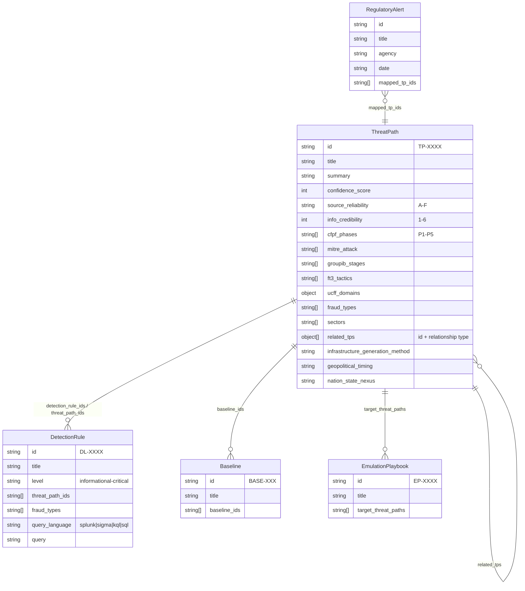

# FLAME Architecture

> Last updated: 2026-03-27

This document describes the technical architecture of the FLAME (Financial Fraud & Laundering Analysis, Monitoring & Enforcement) project -- a community-driven, open-source fraud intelligence knowledge base.

---

## 1. System Overview

FLAME is a structured repository of fraud threat intelligence designed to bridge the gap between cybersecurity and fraud operations teams. It follows a **markdown-first design philosophy**: all primary content (threat paths, baselines, detection logic) is authored as human-readable markdown or YAML files in the repository, then compiled into machine-consumable formats (SQLite, JSON, STIX 2.1, MISP, Sigma, TAXII) by an automated build pipeline.

**Core principles:**

- **TLP:WHITE** -- all content is intended for unrestricted sharing across the financial services community.
- **Community-driven** -- contributions arrive via GitHub Issues and Pull Requests; AI-assisted intake and peer review workflows accelerate triage.
- **No server-side computation** -- the entire site is deployed as static files to GitHub Pages. All "API" endpoints are pre-generated JSON files.
- **Framework-agnostic intelligence** -- each threat path maps to multiple frameworks (CFPF, MITRE ATT&CK, Group-IB Fraud Matrix, Stripe FT3, UCFF) so consumers can view intelligence through whichever lens their organization uses.

The project currently contains 81 Threat Paths, 211 Detection Rules, 35 Baselines, and 14 Emulation Playbooks.

---

## 2. Data Model

FLAME's data model centers on the **ThreatPath** entity, which describes a complete fraud kill chain. All other entities relate to it.

### Entity Relationships



### Relationship Types (related_tps)

ThreatPath-to-ThreatPath relationships are typed, enabling directional graph analysis:

| Relationship | Direction | Example |
|---|---|---|
| `feeds-into` | Upstream to downstream | Credential harvesting feeds into account takeover |
| `enables` | Prerequisite to dependent | SIM swap enables crypto ATO |
| `enhances` | Augments effectiveness | Deepfake voice enhances vishing |
| `provides-mules-for` | Monetization support | Mule recruitment provides mules for wire fraud |
| `shares-infrastructure` | Lateral/shared | Two TPs reusing same domain infrastructure |
| `escalates-from` | Lower to higher severity | Card testing escalates to bust-out fraud |

### Cross-Cutting Framework Mappings

Every ThreatPath can be viewed through five framework lenses:

- **CFPF Phases (P1-P5)**: Recon, Initial Access, Positioning, Execution, Monetization -- the primary organizing taxonomy.
- **MITRE ATT&CK**: Enterprise technique IDs for cyber-fraud convergence.
- **Group-IB Fraud Matrix**: 10-stage fraud lifecycle (Reconnaissance through Laundering).
- **Stripe FT3 (Fraud Threat Taxonomy & Techniques)**: Fintech-oriented tactic mappings.
- **UCFF (Unified Cyber-Fraud Framework)**: Organizational maturity domains (COMMIT, ASSESS, PLAN, ACT, MONITOR, REPORT, IMPROVE).

---

## 3. Build Pipeline

The central build script is `scripts/build_database.py`. It reads all markdown and YAML source files and produces every downstream artifact in a single invocation.

### Flow

```
Source Files                    Build Script                     Output Artifacts
────────────                    ────────────                     ────────────────
ThreatPaths/*.md ──┐
Baselines/*.md ────┤            build_database.py
DetectionLogic/*.yml ──┤        ├─ extract_frontmatter()         database/flame.db (SQLite)
data/cfpf_techniques.json ─┤   ├─ extract_body()                database/flame-data.json (legacy)
data/regulatory_alerts.csv ─┘  ├─ load_submission()              database/flame-index.json
                                ├─ load_detection_rule()          database/flame-content/*.json
                                ├─ build_regulatory_alerts()      database/flame-stats.json
                                ├─ export_json()                  database/flame-search-index.json
                                ├─ export_index_json()            database/flame_detection_rules.json
                                ├─ export_content_files()         database/flame-evidence-index.json
                                ├─ export_evidence_index()        database/regulatory-alerts.json
                                ├─ export_regulatory_json()       database/flame-contributors.json
                                ├─ export_detection_rules_json()  api/v1/threat-paths/*.json
                                ├─ export_search_index()          api/v1/threat-paths.json
                                ├─ export_stats_json()            api/v1/detection-rules.json
                                ├─ export_index_md()              api/v1/baselines.json
                                ├─ export_api_v1()                api/v1/stats.json
                                ├─ generate_rss_feed()            api/v1/taxonomy.json
                                └─ extract_contributors()         api/v1/coverage-matrix.json
                                                                  ThreatPaths/INDEX.md
                                                                  feed.xml (RSS)
```

### Export Scripts (run separately in CI)

After `build_database.py`, the CI pipeline runs four additional export scripts that read from the SQLite database or JSON outputs:

| Script | Input | Output |
|---|---|---|
| `scripts/export_flame_stix.py` | `database/flame.db` | `flame-stix-bundle.json` (STIX 2.1 bundle) |
| `scripts/export_sigma.py` | Detection rules | Sigma YAML rule packs |
| `scripts/export_misp.py` | `database/flame.db` | MISP galaxy and MISP feed files |
| `scripts/export_taxii.py` | STIX bundle | `api/taxii/` static TAXII 2.1 endpoints |

---

## 4. Frontend Architecture

The frontend is a **vanilla JavaScript single-page application** with zero build tooling -- no bundler, no transpiler, no framework. It consists of three main modules:

### Module Structure

| File | Responsibility |
|---|---|
| `app.js` | Main application: routing, search, filters, card grid, detail view, modals |
| `flame-data.js` | Data loading: `FlameData` singleton with lazy-load pattern |
| `viz.js` | Visualization: `FlameViz` module with D3-based graphs |

### Routing

Hash-based routing drives view transitions:

| Hash | View | Description |
|---|---|---|
| `#browse` | Browse | Card grid with faceted search and filters |
| `#detail/TP-XXXX` | Detail | Full threat path content, lazy-loaded on demand |

The `handleRoute()` function in `app.js` listens for `hashchange` events and dispatches to `showBrowseView()` or `showDetailView(tpId)`.

### Data Loading (FlameData)

`FlameData` implements a two-tier loading strategy for performance:

1. **On init**: Loads `flame-index.json` (metadata only -- id, title, phases, sectors, fraud types) and `flame-stats.json`. This is fast and sufficient for the browse/search view.
2. **On demand**: When a user navigates to a detail view, `loadContent(tpId)` fetches the individual content file from `database/flame-content/TP-XXXX.json`. Results are cached in `_contentCache`.
3. **Search index**: `loadSearchIndex()` fetches `flame-search-index.json` and builds a lunr.js full-text index. Falls back to substring matching if unavailable.
4. **Detection rules**: `loadDetectionRules(tpId)` fetches the full rules file once, then filters client-side by threat path ID.
5. **Regulatory alerts**: `loadRegulatoryAlerts()` loads alerts non-fatally (panel stays hidden if the file is missing).

### Visualization (FlameViz)

`FlameViz` provides three D3-powered visualization components:

1. **Global Relationship Graph** -- Force-directed graph showing all ThreatPath-to-ThreatPath relationships, with edges color-coded by relationship type (feeds-into, enables, enhances, etc.).
2. **Per-TP Ego Neighborhood Graph** -- Focused force-directed graph centered on a single ThreatPath, showing its immediate upstream, downstream, and lateral connections.
3. **CFPF Attack Flow Diagram** -- HTML/CSS-rendered phase flow showing how a threat path moves through P1-P5.

### Application State

State is managed through module-scoped variables in the `app.js` IIFE:

- `allSubmissions` / `filteredSubmissions` -- full and filtered dataset arrays
- `activeFilters` -- sets for `cfpf_phases`, `sectors`, `fraud_types`
- `searchQuery` -- current search text
- `activeTaxonomy` -- which framework lens is active (`cfpf`, `mitre`, `groupib`, `ft3`)
- `viewState` -- `browse` or `detail`

---

## 5. API Layer

### Static JSON API (v1)

All API endpoints are pre-generated JSON files served from `api/v1/`. Every response follows a standard envelope:

```json
{
  "meta": {
    "version": "1.0",
    "generated_at": "2026-03-28T23:08:38Z",
    "total": 81
  },
  "data": [ ... ]
}
```

**Endpoints:**

| Path | Description |
|---|---|
| `api/v1/threat-paths.json` | All threat paths (index) |
| `api/v1/threat-paths/TP-XXXX.json` | Individual threat path (full content) |
| `api/v1/detection-rules.json` | All detection rules |
| `api/v1/detection-rules/DL-XXXX.json` | Individual detection rule |
| `api/v1/baselines.json` | All baselines |
| `api/v1/stats.json` | Aggregate statistics |
| `api/v1/taxonomy.json` | Framework taxonomy data |
| `api/v1/coverage-matrix.json` | Cross-reference matrix |

### TAXII 2.1 Static Endpoints

FLAME exposes a static TAXII 2.1 server at `api/taxii/`. This is not a live server -- it is pre-generated JSON files that conform to the TAXII 2.1 specification, consumable by any TAXII client.

| Path | Description |
|---|---|
| `api/taxii/discovery.json` | Server discovery (api_roots, contact) |
| `api/taxii/default/collections.json` | Available collections |
| `api/taxii/default/collections/flame-threat-paths/` | Threat path STIX objects |
| `api/taxii/default/collections/flame-detection-rules/` | Detection rule STIX objects |
| `api/taxii/default/collections/flame-baselines/` | Baseline STIX objects |

### MCP Server (Model Context Protocol)

The `mcp_server/server.py` module provides a local MCP server for LLM integration, built on the `MCPServer` framework. It exposes 6 tools:

| Tool | Purpose |
|---|---|
| `search_threat_paths` | Search by keyword, sector, fraud type, CFPF phase, infrastructure method, geopolitical timing, or nation-state nexus |
| `get_threat_path` | Retrieve full details for a specific TP |
| `map_framework` | Get framework-specific mappings (CFPF, MITRE, Group-IB, FT3, UCFF) for a TP |
| `assess_coverage` | Assess detection coverage for given sectors and fraud types, returning gap analysis |
| `get_baseline` | Retrieve fraud baseline measurements by baseline ID or related TP |
| `look_left_right` | Analyze upstream/downstream relationships using CFPF Look Left/Right methodology |

The MCP server runs locally (not deployed to GitHub Pages) and loads data from the JSON exports via `FlameDataLoader`. It is consumed by LLM-powered tools (e.g., Claude Desktop) that connect over stdio.

---

## 6. CI/CD Pipelines

FLAME uses 7 GitHub Actions workflows:

### 1. Build & Deploy (`build-and-deploy.yml`)

**Triggers:** Push to `main` (when ThreatPaths, scripts, tests, Baselines, DetectionLogic, or config change), pull requests to `main`, or after `Fetch Regulatory Data` workflow completes.

**Jobs:**
- `test` -- Run pytest suite
- `validate` -- Validate all threat path markdown files via `validate_submission.py`
- `build` -- Build database, export STIX/Sigma/MISP/TAXII, commit artifacts back to `main`

This is the primary pipeline. The build job only runs on push to main (not on PRs).

### 2. Validate PR (`validate-pr.yml`)

**Triggers:** Pull requests touching ThreatPaths, Baselines, DetectionLogic, scripts, or requirements.txt.

Runs validation checks on proposed submissions without building or deploying.

### 3. AI Intake (`ai-intake.yml`)

**Triggers:** Issues opened or labeled.

Automates initial triage of community-submitted threat intelligence via AI analysis.

### 4. Generate Threat Path (`generate_threat_path.yml`)

**Triggers:** Issues opened.

AI-assisted generation of structured threat path markdown from unstructured issue descriptions.

### 5. Peer Review (`peer-review.yml`)

**Triggers:** Issues labeled.

Initiates the peer review workflow when submissions are flagged for review.

### 6. Fetch Regulatory Data (`fetch-regulatory.yml`)

**Triggers:** Cron schedule (weekdays at 06:00 and 18:00 UTC), manual dispatch.

Fetches regulatory alerts from external sources and updates `data/regulatory_alerts.csv`. On completion, triggers the Build & Deploy workflow.

### 7. Update Database (`update-database.yml`)

**Triggers:** Push to `main` when ThreatPaths, Baselines, DetectionLogic, or data files change.

A lighter-weight rebuild that updates the database without the full STIX/MISP/Sigma/TAXII export chain.

---

## 7. Deployment

FLAME is deployed as a **static site on GitHub Pages** from the `main` branch.

- **Domain**: `flameintel.org` (configured via `CNAME` file in the repository root)
- **No server-side computation**: Every page, API response, TAXII endpoint, and data file is a pre-generated static asset committed to the repository.
- **Build artifacts are committed**: The CI pipeline commits generated files (database, API JSON, STIX bundles, stats) directly to `main`. This means the deployed site is always the latest commit on `main`.
- **MCP server runs locally**: The MCP server in `mcp_server/` is not deployed -- users clone the repo and run it on their own machines to integrate with local LLM tools.
- **RSS feed**: `feed.xml` at the repository root provides an RSS feed of new and updated threat paths.

### Directory Layout (Key Paths)

```
flame-fraud/
├── ThreatPaths/          # Source markdown (TP-XXXX.md)
├── Baselines/            # Source markdown (BASE-XXX.md)
├── DetectionLogic/       # Source YAML (DL-XXXX.yml)
├── EmulationPlaybooks/   # JSON playbooks (EP-XXXX.json)
├── data/                 # Reference data (cfpf_techniques.json, regulatory_alerts.csv)
├── database/             # Build outputs (SQLite, JSON index, content files, stats)
├── api/
│   ├── v1/              # Static JSON API
│   └── taxii/           # Static TAXII 2.1 endpoints
├── scripts/             # Build and export scripts
├── mcp_server/          # MCP server for LLM integration
├── tests/               # pytest test suite
├── app.js               # Frontend application
├── flame-data.js        # Data loading module
├── viz.js               # D3 visualization module
├── index.html           # SPA entry point
├── flame-stix-bundle.json  # STIX 2.1 bundle
└── feed.xml             # RSS feed
```

---

## 8. Extension Points

### Adding a New Export Format

1. Create a new script at `scripts/export_<format>.py`.
2. Read from `database/flame.db` (SQLite) or the JSON exports in `database/`.
3. Write output to the appropriate directory (e.g., `api/<format>/` or a top-level file).
4. Add the export step to `.github/workflows/build-and-deploy.yml` in the `build` job, after `build_database.py`.
5. Add the output path to the `git add` line in the commit step.

### Adding a New Framework Mapping

1. Add the framework fields to the ThreatPath markdown frontmatter schema.
2. Update `scripts/build_database.py` to parse and store the new fields (in `load_submission()` and the relevant export functions).
3. Update `mcp_server/server.py` -- add a new branch in the `map_framework` tool.
4. Update `app.js` to add the framework as a taxonomy toggle option.
5. Update `viz.js` if the framework has a visual representation.

### Adding a New Entity Type

1. Create a new source directory (e.g., `NewEntities/`) with markdown or YAML templates.
2. Add parsing logic in `build_database.py` -- follow the pattern of `find_markdown_files()` / `find_dl_files()` and create a `load_<entity>()` function.
3. Create an SQLite table in `init_database()`.
4. Add JSON export functions and wire them into `main()`.
5. Add API v1 endpoints in `export_api_v1()`.
6. Update `flame-data.js` if the frontend needs to load the new entity type.
7. Update the validation script (`scripts/validate_submission.py`) for the new format.

### Adding a New MCP Tool

1. Add a new function decorated with `@mcp.tool()` in `mcp_server/server.py`.
2. Implement the data access in `mcp_server/data_loader.py` (the `FlameDataLoader` class).
3. Return JSON-serialized results. Follow the existing pattern of accepting filter parameters and returning structured data.
4. The tool is automatically discoverable by MCP clients -- no registration step required.

### Adding a New Detection Rule Query Language

1. Author the detection rule YAML file in `DetectionLogic/` with the new `query_language` value.
2. The build pipeline will ingest it as-is -- the `query` field is stored as a string regardless of language.
3. If the new language needs a dedicated export format (like Sigma), create an export script following the pattern of `scripts/export_sigma.py`.
4. Update the frontend's detection rule rendering in `app.js` if syntax highlighting or special formatting is needed.
